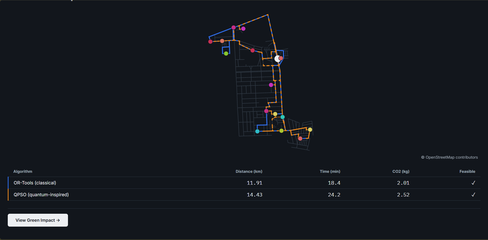

# Quantum Traffic Route Optimization

A vehicle-routing optimizer that runs a **quantum-inspired swarm algorithm (QPSO)** head-to-head against a classical baseline (**Google OR-Tools**) on real road networks, and reports the route quality along with the CO2 and time impact.

Built for Smart India Hackathon 2026 (problem statement SIH26137).



*Both solvers route the same delivery points on the Indiranagar (Bengaluru) road graph. Blue is OR-Tools, orange dashed is QPSO. Results vary by scenario, vehicle count and random seed.*

## What it does

- Solves the **Capacitated Vehicle Routing Problem (CVRP)**: one depot, several vehicles with a capacity limit, many delivery stops.
- Uses **real road distances** from OpenStreetMap (via OSMnx), cached offline so the app needs no internet or paid traffic API at runtime.
- Adds **stochastic traffic delay** (log-normal, with morning and evening peaks, following SVRPBench).
- Runs **OR-Tools** and **QPSO** under the same time budget and seed, so the comparison is fair, and streams the QPSO convergence live to a chart.
- Estimates **CO2** per route with a COPERT-based speed curve, and shows the savings between the two solvers.
- Lets you **inject a road accident** on the map and see how both solvers re-route around it.

## How QPSO works here

QPSO is a particle swarm whose particles move by quantum-style probabilistic jumps instead of fixed velocities. Here it is a **memetic hybrid**: the swarm explores for part of the time budget, then a bounded local search (relocation, 2-opt, ruin-and-recreate) improves its best routes. The final answer is the candidate with the lower estimated CO2.

Honest results: QPSO ties or beats OR-Tools on CO2 in most tested scenarios (for example +4.7% at 60 nodes) and is slightly behind in some (for example 1.4% at 30 nodes). OR-Tools optimizes time while QPSO picks by CO2, so read the CO2 numbers with that in mind. Full tables and caveats are in [EXPLAINABILITY.md](EXPLAINABILITY.md).

## Tech stack

| Part | Tools |
|---|---|
| Backend | Python, FastAPI, OSMnx, NetworkX, NumPy, OR-Tools |
| Frontend | React 19, TypeScript, Vite, deck.gl (map), Recharts (convergence chart) |
| Packaging | Docker Compose |

## Project layout

```
backend/    FastAPI app (domain / application / infrastructure / presentation)
frontend/   React + deck.gl UI
tests/      unit, integration and property-based tests
cache/      pre-fetched Indiranagar road graph (.graphml)
docs/       demo scenarios (CSV delivery nodes) and images
```

## Run it

With Docker:

```bash
docker compose up --build
```

Backend at http://localhost:8000 (health check: `/health`), frontend at http://localhost:4173.

Without Docker:

```bash
# backend
cd backend
pip install -r requirements.txt
uvicorn app.main:app --reload

# frontend (new terminal)
cd frontend
npm install
npm run dev
```

Run the tests from the repo root with `pytest`.

Demo delivery sets are in `docs/demo_scenarios/` (5, 15, 30 and 60 nodes). Upload one in the app to try it.

## More docs

- [EXPLAINABILITY.md](EXPLAINABILITY.md): what was built in each phase, bugs found, and benchmark results
- [PRODUCT.md](PRODUCT.md) and [DESIGN.md](DESIGN.md): product goals and design decisions
- [DEMO_VIDEO_SCRIPT.md](DEMO_VIDEO_SCRIPT.md): demo walkthrough script
